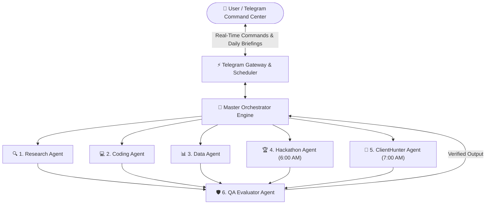

# 🤖 24/7 Autonomous Multi-Agent AI Orchestrator

**An enterprise-grade, cloud-deployed Multi-Agent AI Architecture managing 6 specialized autonomous sub-agents with real-time Telegram Command Center & scheduled intelligence briefings.**

  
  
  
  

---

## 🌟 System Overview

The **Multi-Agent AI Orchestrator** is a production-ready autonomous system designed to automate deep web research, commercial lead discovery, software engineering tasks, data analytics, and global hackathon tracking. Instead of relying on a single monolithic prompt, a central **Master Orchestrator** dynamically routes tasks to **6 specialized sub-agents**, verifies output quality via an **Evaluator Agent**, and delivers actionable reports directly to Telegram.

---

## 🏗️ System Architecture

---

## 🧩 The 6 Specialized Sub-Agents

| # | Sub-Agent | Core Responsibility & Autonomous Schedule |
| :-: | :--- | :--- |
| **1** | **🔍 Research Agent** | Performs multi-source live web research, synthesizes technical documentation, and extracts structured executive summaries. |
| **2** | **💻 Coding Agent** | Generates production-grade Python/JS modules, reviews code architecture, and resolves runtime bugs. |
| **3** | **📊 Data Agent** | Processes structured datasets, evaluates business metrics, and formats clean analytical reports. |
| **4** | **🏆 Hackathon Agent** | **Scheduled (6:00 AM Daily):** Scans global AI & Software hackathons, filters active high-value competitions, and sends morning alerts. |
| **5** | **🎯 ClientHunter & Business X-Ray** | **Scheduled (7:00 AM Daily):** Identifies commercial businesses, performs an automated digital X-Ray of their operational bottlenecks, and prepares tailored AI automation pitches. |
| **6** | **🛡️ Evaluator Agent** | Acts as the final Quality Assurance gate—reviewing sub-agent outputs for accuracy, completeness, and formatting before delivery. |

---

## 📂 Project Architecture

- `agents/master_orchestrator.py` — Central routing & state coordination engine
- `agents/research_agent.py` — Deep web & topic synthesis agent
- `agents/coding_agent.py` — Software architecture & code synthesis agent
- `agents/data_agent.py` — Data processing & reporting agent
- `agents/hackathon_agent.py` — Automated competition tracker (06:00 AM BD Time)
- `agents/client_hunter_agent.py` — Commercial lead & business X-Ray agent (07:00 AM BD Time)
- `agents/evaluator_agent.py` — Quality assurance & output verification agent
- `core/scheduler.py` — Fault-tolerant timezone-aware background scheduler
- `core/telegram_gateway.py` — Asynchronous Telegram Bot interface

---

## 🔒 Security & Deployment Standards

- **Zero-Secret Repository:** Strict `.gitignore` policies ensure `.env` files and API credentials are never committed to version control.
- **Persistent State Recovery:** Automatically persists active session & chat metadata across cloud container restarts.
- **24/7 Cloud Uptime:** Engineered for continuous background execution on **Render** with health-check endpoints.

---

## 👨‍💻 Architected By

**Jubayer Ahamed**  
*AI Automation & Software Solutions Specialist | Founder @ [Be Smart With AI](https://www.facebook.com/besmartwithaipro)*

- 💬 **WhatsApp Direct:** [+880 1610-594042](https://wa.me/8801610594042)
- 🌐 **Facebook Page:** [Be Smart With AI](https://www.facebook.com/besmartwithaipro)
- 📧 **Email:** [sbmc4042@gmail.com](mailto:sbmc4042@gmail.com)